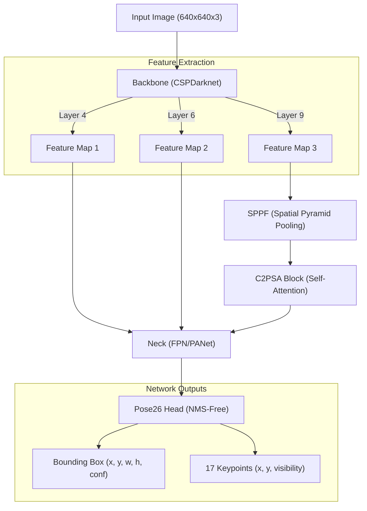

# 🏃‍♂️ คู่มือเจาะลึกการเทรน Body Model (YOLO26n-Pose)
**อ้างอิงจากไฟล์ล่าสุด:** `CPE_303_Training_BODY_Part_V6_Yolo26n.ipynb`

เอกสารฉบับนี้เป็นการอธิบายระดับวิศวกร (Deep Dive) ที่รวมเอา "หลักการเชิงลึกแบบเดิม" และ "การอธิบายโค้ดจากไฟล์ล่าสุดทุกบรรทัด" เข้าไว้ด้วยกัน เพื่อให้เห็นทั้งโครงสร้างภาพรวมและรายละเอียดการทำงานของ AI สำหรับตรวจจับพิกัดร่างกาย (Body Pose Detection)

---

## 1. 📊 ข้อมูลชุดข้อมูล (Dataset) และการเตรียมข้อมูล (Data Preparation)

### 📂 ชุดข้อมูลที่ใช้: COCO-Pose (COCO 2017 Keypoints)
โมเดล YOLO26n-Pose ถูกฝึกสอนโดยใช้ชุดข้อมูลมาตรฐานระดับโลกอย่าง COCO-Pose ซึ่งประกอบไปด้วยภาพที่มีคนอยู่ในอิริยาบถต่างๆ จำนวน 56,599 ภาพสำหรับฝึกสอน

**โครงสร้างและตัวอย่างข้อมูลใน Dataset:**
*   **โครงสร้างโฟลเดอร์:** ประกอบด้วยโฟลเดอร์ `images` (เก็บไฟล์ภาพ .jpg) และ `labels` (เก็บไฟล์ .txt)
*   **รูปแบบข้อมูล (YOLO Format):** ในไฟล์ `.txt` แต่ละบรรทัดจะระบุตำแหน่งของคน 1 คน ในรูปแบบ:
    `[class_id] [x_center] [y_center] [width] [height] [px1] [py1] [vis1] ... [px17] [py17] [vis17]`
*   **คีย์พอยต์ 17 จุด:** ประกอบด้วย จมูก(0), ตาซ้าย/ขวา(1,2), หูซ้าย/ขวา(3,4), ไหล่(5,6), ศอก(7,8), ข้อมือ(9,10), สะโพก(11,12), เข่า(13,14), และข้อเท้า(15,16) โดยค่า `vis` บ่งบอกว่าจุดนั้นถูกบังอยู่หรือไม่ (Visibility)

### 🛠️ ขั้นตอนการเตรียมข้อมูลจาก Dataset สู่โมเดล (Step-by-Step Data Preparation)
กระบวนการนี้ถูกจัดการอัตโนมัติผ่าน `coco-pose.yaml` และ Data Loader ของ YOLO:
1.  **โหลดและจับคู่ข้อมูล (Loading & Matching):** ระบบจะอ่านไฟล์ภาพ `.jpg` และอ่านไฟล์ `.txt` เพื่อวาด Bounding Box และจุด 17 จุดลงบนภาพ
2.  **การทำ Data Augmentation เชิงพื้นที่ (Spatial Augmentation):**
    *   **Mosaic:** นำภาพ 4 ภาพมาตัดแปะรวมกันเป็นภาพเดียว เพื่อให้โมเดลเรียนรู้การตรวจจับคนในขนาดสเกลที่หลากหลาย และคุ้นเคยกับภาพที่คนถูกบดบังบางส่วน
    *   **Random Perspective & Flip:** สุ่มพลิกภาพซ้ายขวา และบิดมุมมองจำลองการเอียงกล้อง
3.  **การทำ Data Augmentation เชิงสีสัน (Color Augmentation):**
    *   สุ่มปรับค่า HSV (Hue, Saturation, Value) ทำให้โมเดลทนทานต่อแสงเงา แสงมืด หรือสีที่เพี้ยนจากกล้องเว็บแคม
4.  **การปรับขนาด (Letterbox Resize):** ย่อ/ขยายภาพให้มีขนาด `640x640` พิกเซล (`imgsz=640`) โดยยังคงอัตราส่วนเดิมของภาพไว้ (Aspect Ratio) พื้นที่ที่เหลือจะถูกถมด้วยแถบสีเทา (Padding) เพื่อไม่ให้สัดส่วนของคนผิดเพี้ยน
5.  **การแปลงเป็น Tensor (Normalization):** แปลงค่าพิกเซลจาก `0-255` เป็นทศนิยม `0.0-1.0` และนำเข้าคิวเพื่อเตรียมส่งให้ GPU คำนวณแบบขนานเป็นชุดๆ (`batch=32`)

---

## 2. 🧠 สถาปัตยกรรม Neural Network (YOLO26n-Pose)

โมเดลที่เลือกใช้คือ YOLO26 รุ่น Nano (n) ซึ่งเป็นสถาปัตยกรรม State-of-the-Art สำหรับงาน Object Detection และ Pose Estimation ที่เน้นความเร็วขั้นสุด เหมาะสำหรับ Cascade Architecture



**เหตุผลที่ใช้โครงสร้างนี้:**
*   **CSPDarknet & C2PSA:** ใช้อัลกอริทึม Cross Stage Partial Network ผสมกับ Self-Attention (C2PSA) ทำให้ดึงจุดเด่นของภาพออกมาได้แม่นยำแม้ตัวแบบจะขยับตัวเร็ว
*   **NMS-Free Head:** หัวโมเดล Pose26 รุ่นใหม่ตัดระบบ Non-Maximum Suppression (NMS) ออกไป ทำให้ประหยัดเวลาในการประมวลผล (Post-processing) ลด Latency ลงไปได้หลายมิลลิวินาที ทำให้ทำ 60FPS ได้จริง

---

## 3. ⚙️ ขั้นตอนการทำงานและเทคนิคเชิงลึก (Deep Dive Techniques)

1.  **Multi-Scale Inference (imgsz=640):** การบีบอัดภาพให้อยู่ในขนาด 640x640 ก่อนเข้าโมเดล เป็นจุดสมดุลที่ดีที่สุด (Sweet Spot) สำหรับ YOLO ที่รักษาความแม่นยำไว้ได้โดยไม่ทำให้ GPU โหลดหนักเกินไป
2.  **Automatic Mixed Precision (AMP):** การทำงานด้วยทศนิยมแบบ 16-bit (FP16) ผสมกับ 32-bit (FP32) บนชิป Tensor Core ของการ์ดจอ L4 ทำให้ใช้ VRAM น้อยลงและคำนวณเร็วขึ้น
3.  **Auto Optimizer & Hyperparameters:** โมเดลปรับพารามิเตอร์การฝึก (เช่น Learning Rate = 0.01, Momentum = 0.9) ผ่าน MuSGD โดยอัตโนมัติตามโครงสร้างของ Data

---

## 4. 💻 เจาะลึกโค้ดบรรทัดต่อบรรทัด (อิงจากสมุดโน้ตจริง)

### Cell 1: เตรียมสภาพแวดล้อม
```python
# ==========================================
# 1. ติดตั้งสภาพแวดล้อมสำหรับ YOLO11
# ==========================================
!pip install -U ultralytics -q
from google.colab import drive
import os

drive.mount('/content/drive')
save_model_dir = "/content/drive/MyDrive/CPE-306/models/yolo_body"
os.makedirs(save_model_dir, exist_ok=True)

import ultralytics
print("✅ เช็คเวอร์ชัน YOLO:")
ultralytics.checks()
```
*   `!pip install -U ultralytics -q`: ติดตั้งไลบรารีเบื้องหลังของ YOLO เวอร์ชันล่าสุด โดยไม่ให้แสดง log รกหน้าจอ (`-q`)
*   `drive.mount('/content/drive')`: เชื่อมพื้นที่เก็บข้อมูลเพื่อใช้สำหรับบันทึกไฟล์ .onnx ที่จะนำไปใช้งานจริงแบบ Offline
*   `os.makedirs(..., exist_ok=True)`: สร้างโฟลเดอร์ปลายทาง ถ้ามีอยู่แล้วให้ข้ามไปเพื่อไม่ให้เกิด Error
*   `ultralytics.checks()`: ตรวจสอบความพร้อมของ GPU (ใช้ L4) และแจ้งเตือนหาก RAM/Disk ไม่พอ

### Cell 2: การเทรนโมเดล (YOLO26-Pose)
```python
# ==========================================
# 2. เริ่มเทรน YOLO26-Pose (Body Model รุ่นใหม่ล่าสุด!)
# ==========================================
from ultralytics import YOLO

# 🌟 เปลี่ยนมาใช้ YOLO26 รุ่น Nano (NMS-Free เร็วและเสถียรขึ้นมาก)
model = YOLO('yolo26n-pose.pt')

print("🚀 กำลังเริ่มต้นกระบวนการเทรน YOLO26...")
results = model.train(
    data='coco-pose.yaml',
    epochs=15,
    imgsz=640,
    batch=32,
    project='VTuber_Body',
    name='YOLO26_Train',   # 🌟 เปลี่ยนชื่อโฟลเดอร์เซฟงานเป็น YOLO26
    device=0,
    plots=True
)
print(f"✅ เทรนเสร็จสิ้น! โมเดลและกราฟถูกเซฟไว้ในโฟลเดอร์ VTuber_Body/YOLO26_Train/")
```
*   `model = YOLO('yolo26n-pose.pt')`: โหลด Pre-trained Model รหัส 'n' (Nano) มาเป็นน้ำหนักเริ่มต้น
*   `data='coco-pose.yaml'`: ใช้ฐานข้อมูล COCO สำหรับงาน Pose (คน 17 จุด) ซึ่งมีภาพกว่า 56,599 ภาพ โมเดลจะโหลดไฟล์นี้มาเอง
*   `epochs=15`: จำนวนรอบในการสอน เนื่องจากเราใช้ Pre-trained Model มา Fine-tune การใช้ 15 รอบถือว่าเพียงพอแล้วสำหรับการชักนำ AI ให้เก่งขึ้นโดยไม่สูญเสียความรู้เดิม (Overfitting)
*   `imgsz=640`: ตั้งค่าขนาดภาพรับเข้า (Input Size)
*   `batch=32`: ส่งภาพจำนวน 32 ภาพไปให้ GPU คำนวณพร้อมกันใน 1 ครั้ง
*   `project='...'` และ `name='...'`: กำหนดจุดเซฟไฟล์และชื่อโมเดล เพื่อไม่ให้ไปปนกับโมเดลการทดลองตัวอื่น
*   `device=0`: ระบุให้ใช้ชิปประมวลผล GPU ตัวแรก
*   `plots=True`: สั่งวาดกราฟ Loss และ Precision แบบอัตโนมัติ

### Cell 3: ส่งออกเป็น ONNX
```python
# ==========================================
# 🌟 ค้นหาโมเดลอัตโนมัติ & Export เป็น ONNX
# ==========================================
import os
import shutil
from pathlib import Path
from ultralytics import YOLO

print("🔍 กำลังสแกนหาไฟล์ best.pt ทั่วทั้ง Colab...")
all_best_pts = [p for p in Path("/content/").rglob("best.pt") if "drive" not in str(p)]

if not all_best_pts:
    print("❌ ไม่พบไฟล์ best.pt เลยครับ (อาจจะต้องกดเทรนที่ Cell 2 ใหม่อีกรอบเพราะการเทรนก่อนหน้าอาจจะถูกขัดจังหวะ)")
else:
    latest_best_pt = max(all_best_pts, key=os.path.getmtime)
    print(f"🎯 เจอโมเดลล่าสุดแล้วที่: {latest_best_pt}")

    print("🤖 โหลดโมเดลเพื่อทำการแปลงไฟล์...")
    best_model = YOLO(latest_best_pt)

    print("⚙️ กำลังแปลงโมเดลเป็น .onnx สำหรับ Local Production...")
    onnx_path = best_model.export(format="onnx", imgsz=640)
    print(f"✅ แปลงไฟล์ ONNX สำเร็จ!")

    save_model_dir = "/content/drive/MyDrive/CPE-306/models/yolo_body"
    os.makedirs(save_model_dir, exist_ok=True)

    shutil.copy(latest_best_pt, save_model_dir)
    shutil.copy(onnx_path, save_model_dir)

    print(f"\n🎉 สำเร็จทุกขั้นตอน! ไฟล์ .pt และ .onnx ถูกเซฟอย่างปลอดภัยใน Google Drive แล้วที่:")
    print(f"👉 {save_model_dir}")
```
*   `Path("/content/").rglob("best.pt")`: ค้นหาไฟล์ที่ดีที่สุดจากการฝึกแบบเจาะลึก (Recursive search) ใน `/content/`
*   `max(..., key=os.path.getmtime)`: ตรวจเช็กเวลาล่าสุด เพื่อให้ได้โมเดลที่เราเพิ่งรันเสร็จจริงๆ (อิงตาม Modified Time)
*   `best_model.export(format="onnx", imgsz=640)`: แปลง PyTorch Graph ไปเป็น ONNX ซึ่งเป็นฟอร์แมตกลางที่สามารถนำไปรันบน C++ / C# / หรือ Python (ONNXRuntime) ได้ด้วยความเร็วสูงกว่าเดิมมาก
*   `shutil.copy(...)`: โค้ดย้ายไฟล์อัตโนมัติไปยัง Google Drive เพื่อสำรองข้อมูล
