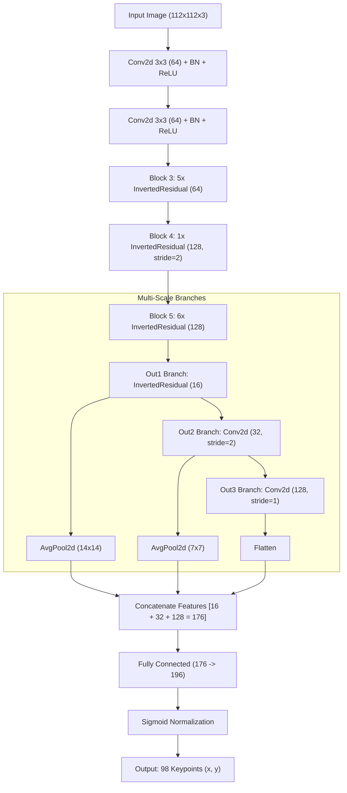

# 😃 คู่มือเจาะลึกการเทรน Face Model (PFLD - 98 Keypoints)
**อ้างอิงจากไฟล์ล่าสุด:** `CPE_303_Training_FACE_Part_V4 (1).ipynb`

เอกสารฉบับนี้เป็นการอธิบายระดับวิศวกร (Deep Dive) ที่รวมเอา "หลักการเชิงลึกแบบเดิม" และ "การอธิบายโค้ดจากไฟล์ล่าสุดทุกบรรทัด" เข้าไว้ด้วยกัน เพื่อให้เข้าใจทั้งภาพรวม ทฤษฎีคณิตศาสตร์ และการตั้งค่าแต่ละพารามิเตอร์ของโมเดล PFLD สำหรับระบุพิกัดใบหน้า 98 จุด

---

## 1. 📊 ข้อมูลชุดข้อมูล (Dataset) และการเตรียมข้อมูล (Data Preparation)

### 📂 ชุดข้อมูลที่ใช้: WFLW (Wider Facial Landmarks in the Wild)
การฝึกโมเดลใบหน้า 98 จุดใช้ข้อมูลจาก WFLW ซึ่งเป็นฐานข้อมูลระดับโลกที่รวบรวมภาพใบหน้าคนในสภาวะที่ท้าทายมาก (เช่น หน้าหันข้าง หน้าโดนผมบัง แสงจ้า แสงมืด) ทำให้โมเดลทนทานต่อสภาพแวดล้อมตอนสตรีมมิ่งจริง

**โครงสร้างและตัวอย่างข้อมูลใน Dataset:**
*   **รูปภาพ:** ภาพใบหน้าคนหลายพันภาพ (7,500 ภาพสำหรับเทรน, 2,500 สำหรับทดสอบ)
*   **ไฟล์ Annotation:** เก็บเป็นไฟล์ Text ชื่อ `list_98pt_rect_attr_train.txt` โดย 1 บรรทัดจะเท่ากับ 1 รูปภาพ
*   **โครงสร้าง 1 บรรทัด (200+ ค่า):**
    *   `[ค่าที่ 1-196]`: พิกัด x, y ของจุดบนใบหน้าทั้ง 98 จุด (รวม 196 ตัวเลข) ซึ่งเรียงตามโครงสร้างมาตรฐาน (คิ้ว ตา จมูก แก้ม ปาก โครงหน้า)
    *   `[ค่าที่ 197-200]`: Bounding Box กล่องล้อมรอบใบหน้า (x_min, y_min, x_max, y_max)
    *   `[ค่าที่ 201-206]`: Attributes บอกคุณสมบัติเช่น ใส่แว่นไหม แสงสว่างไหม ฯลฯ
    *   `[ค่าสุดท้าย]`: ชื่อไฟล์ภาพและ Path

### 🛠️ ขั้นตอนการเตรียมข้อมูลจาก Dataset สู่โมเดล (Step-by-Step Data Preparation)
ก่อนที่ข้อมูลจะถูกป้อนเข้าโมเดล จะต้องผ่านกระบวนการทำ Data Loader และ Data Augmentation ดังนี้:
1.  **อ่านไฟล์ (Parsing):** โค้ดจะอ่านไฟล์ `txt` ทีละบรรทัด แยกข้อความด้วยเว้นวรรค (split) นำเลข 196 ตัวแรกมาเป็นพิกัดคีย์พอยต์ และ 4 ตัวถัดมาเป็นพิกัดกล่อง
2.  **ดึงจุดศูนย์กลางและทำ Square Crop:** คำนวณจุดกึ่งกลางของหน้า และบังคับตัดภาพ (Crop) ให้เป็นรูปสี่เหลี่ยมจัตุรัสเท่านั้น โดยขยายขอบกว้างขึ้น 20% `size = max(w, h) * 1.2` เพื่อป้องกันไม่ให้ใบหน้าเสียรูปทรงตอนบีบเข้าโมเดล
3.  **การหมุนภาพจำลอง (Heavy Rotation Augmentation):** เพื่อให้ AI คุ้นเคยกับหัว VTuber ที่ขยับไปมา ระบบจะสุ่มหมุนภาพคอตั้งแต่ `-20` ถึง `20` องศา ผ่านฟังก์ชัน `cv2.getRotationMatrix2D` 
4.  **หมุนพิกัดตามภาพ (Keypoint Projection):** เมื่อภาพเอียง จุดก็ต้องเอียงตาม ระบบใช้คณิตศาสตร์คูณเมทริกซ์การหมุนเข้ากับคีย์พอยต์ `kpts_ones.dot(M.T)` ทำให้จุดหมุนตามองศาใบหน้าอย่างแม่นยำ
5.  **บีบอัดขนาด (Resize & Normalize Coordinates):** ย่อภาพจัตุรัสให้เหลือ `112x112` พิกเซล และหารค่าพิกัดคีย์พอยต์ทั้งหมดด้วย 112 เพื่อให้จุดกลายเป็นสเกลทศนิยมตั้งแต่ `0.0 ถึง 1.0` (เหมาะสำหรับฟังก์ชัน Sigmoid ในตอนท้าย)
6.  **ปรับสี (ColorJitter) และแปลงเป็น Tensor:** สุ่มปรับความสว่าง/ความต่างสี `0.2` และปรับฐานข้อมูลภาพทั้งหมดให้เป็น Tensor ที่มีค่าเฉลี่ยแกนกลาง (Normalize) ด้วยตรรกะ `[0.5, 0.5, 0.5]` ทำให้ข้อมูลลู่เข้าศูนย์พร้อมนำไปคำนวณใน GPU

---

## 2. 🧠 สถาปัตยกรรม Neural Network (FaceLandmarkModel)

โมเดลที่ใช้คือสถาปัตยกรรมที่พัฒนาต่อยอดมาจาก PFLD (Practical Facial Landmark Detector) ออกแบบมาเพื่อเน้นทำงานแบบ Real-Time บน CPU หรือ Edge Device โดยเฉพาะ



**เหตุผลที่ใช้โครงสร้างนี้:**
*   **InvertedResidual:** ยืมโครงสร้างมาจาก MobileNetV2 ช่วยลดปริมาณพารามิเตอร์ได้อย่างมาก แต่ยังคงความสามารถในการสกัด Features ที่ซับซ้อน
*   **Multi-Scale Branches:** นำภาพตั้งแต่ความละเอียดหยาบ (Out1) ไปจนถึงความละเอียดลึกสุด (Out3) มาบีบอัดแล้วต่อเข้าด้วยกัน (Concatenate) ช่วยให้ AI มองเห็นทั้ง "ตำแหน่งของหน้า" และ "รายละเอียดของรูขุมขน/จุดขอบตา" ได้พร้อมกัน
*   **Sigmoid Bounding:** การใส่ `torch.sigmoid()` ปิดท้าย เป็นกุญแจสำคัญที่ล็อกค่าแกน x, y ไว้ไม่ให้หลุดสเกลภาพ 0.0 - 1.0 แก้อาการทายผิดแบบ Mode Collapse อย่างเด็ดขาด

---

## 3. ⚙️ ขั้นตอนการทำงานและเทคนิคเชิงลึก (Deep Dive Techniques)

1.  **Square Crop Geometry:** การครอปภาพต้องทำให้เป็นสี่เหลี่ยมจัตุรัสเสมอ `size = max(w, h) * 1.2` เพื่อป้องกันไม่ให้โครงหน้าของตัวละครยืดเบี้ยวตอน Resize ไปเป็น `112x112`
2.  **Rotation Augmentation for VTubing:** สุ่มหมุนคอตั้งแต่ `-20` ถึง `20` องศา พร้อมกับหมุนจุด Label ด้วยสมการเมทริกซ์ 2D เพื่อสร้างข้อมูลจำลองการทำสตรีมจริงที่ผู้ใช้งานไม่ได้หันหน้าตรงตลอดเวลา
3.  **VTuber Custom Wing Loss:** ดัดแปลง Wing Loss ดั้งเดิม โดยเขียนตัวถ่วงน้ำหนักคูณความสำคัญของบริเวณดวงตา (จุด 60-76) และปาก (จุด 76-98) เพิ่มขึ้น `3.0 เท่า` ทำให้ AI โดนทำโทษหนักขึ้นถ้าทายบริเวณนี้พลาด

---

## 4. 💻 เจาะลึกโค้ดบรรทัดต่อบรรทัด (อิงจากสมุดโน้ตจริง)

### Cell 1 & 2: ดาวน์โหลดข้อมูล WFLW และแปลงพิกัด (Parsing)
```python
import kagglehub
import os

print("📥 กำลังดาวน์โหลด WFLW Dataset จาก Kaggle...")
dataset_path = kagglehub.dataset_download("mrriandmstique/wflw-wider-facial-landmarks-in-the-wild")

def parse_wflw_file(txt_path, image_folder):
    records = []
    with open(txt_path, 'r') as f:
        lines = f.readlines()

    for line in lines:
        parts = line.strip().split()
        if len(parts) < 200: continue

        landmarks = [float(x) for x in parts[0:196]]
        bbox = [float(x) for x in parts[196:200]]
        img_name = parts[-1]

        records.append({
            "image_path": os.path.join(image_folder, img_name),
            "bbox": bbox,
            "keypoints": landmarks
        })
    return records
```
*   `kagglehub.dataset_download(...)`: ดาวน์โหลด Dataset ของภาพหน้าคน WFLW จาก Kaggle โดยมีข้อดีตรงที่จะแคชไฟล์ไว้ ดึงครั้งหน้าจะไม่ต้องเสียเวลาโหลดอีก
*   `parts = line.strip().split()`: หั่นข้อความ 1 บรรทัดด้วยช่องว่าง
*   `parts[0:196]`: ข้อมูลไฟล์ WFLW เรียงจุดมาเป็น x0, y0, x1, y1 ไปจนถึง 98 จุด (รวม 196 ค่า) จึงหั่นพิกัดนี้ออกมาเก็บในตัวแปร `landmarks`
*   `parts[196:200]`: ค่าตำแหน่งของกล่อง (Bounding Box) 4 ค่าคือ x_min, y_min, x_max, y_max

### Cell 3: Data Loader และ Augmentation Pipeline
```python
class FaceWFLWDataset(Dataset):
    def __init__(self, records, input_size=(112, 112), is_train=False):
        # ... (ซ่อนส่วนเริ่มต้น)
        self.transform = transforms.Compose([
            transforms.ToTensor(),
            transforms.ColorJitter(brightness=0.2, contrast=0.2) if is_train else transforms.Lambda(lambda x: x),
            transforms.Normalize([0.5, 0.5, 0.5], [0.5, 0.5, 0.5])
        ])

    def __getitem__(self, idx):
        # ... (ซ่อนส่วนโหลดภาพ)
        # 🌟 อัปเกรด 1: สุ่มหมุนภาพ (Rotation) ±20 องศา เฉพาะตอนเทรน
        if self.is_train:
            angle = random.uniform(-20, 20)
            M = cv2.getRotationMatrix2D((center_x, center_y), angle, 1.0)
            image = cv2.warpAffine(image, M, (image.shape[1], image.shape[0]))
            kpts_ones = np.hstack([kpts, np.ones((98, 1))])
            kpts = kpts_ones.dot(M.T)

        # บังคับตัดเป็น "สี่เหลี่ยมจัตุรัส (Square Crop)"
        size = max(w, h) * 1.2
        x_min, y_min = max(0, int(center_x - size/2)), max(0, int(center_y - size/2))
        x_max, y_max = min(image.shape[1], int(center_x + size/2)), min(image.shape[0], int(center_y + size/2))
        # ... (ซ่อนส่วนคืนค่า Tensor)
```
*   `ColorJitter(brightness=0.2, contrast=0.2)`: ปรับแสงสว่างและคอนทราสต์แกว่งขึ้นลง 20% เพื่อให้ AI ไม่ยึดติดกับสภาพแสงในสตูถ่ายภาพ
*   `random.uniform(-20, 20)`: สุ่มตัวเลขตั้งแต่องศา -20 ถึง 20
*   `cv2.getRotationMatrix2D(...)`: สร้างตารางเมทริกซ์คำนวณการหมุนตามจุดศูนย์กลางคอ/จมูก
*   `cv2.warpAffine(...)`: ลงมือบิดองศาของภาพทั้งหมด
*   `kpts_ones.dot(M.T)`: เอาเมทริกซ์ 2D Transform มาคำนวณแบบ Dot Product เพื่ออัปเดตจุดที่สุ่มหมุนภาพไปแล้ว
*   `size = max(w, h) * 1.2`: สร้างขอบ Crop จัตุรัสโดยบวกขอบภาพ (Padding) ขึ้นไปอีก 20%

### Cell 4: โครงสร้าง Network และ Wing Loss
```python
# 🌟 อัปเกรด 2: Wing Loss (จับผิดระดับพิกเซล) ผสมกับการถ่วงน้ำหนัก VTuber
class VTuberWingLoss(nn.Module):
    def __init__(self, w=10.0, epsilon=2.0):
        super().__init__()
        self.w = w
        self.epsilon = epsilon
        self.c = w - w * math.log(1 + w / epsilon)

        weights = torch.ones(98, 2)
        weights[60:76, :] = 3.0  # เน้นตา
        weights[76:98, :] = 3.0  # เน้นปาก
        self.register_buffer('weights', weights.view(1, 196))

    def forward(self, pred, target):
        x = torch.abs(pred - target) * 112.0
        loss = torch.where(x < self.w, self.w * torch.log(1 + x / self.epsilon), x - self.c)
        weighted_loss = loss * self.weights
        return weighted_loss.mean()
```
*   `weights[60:76, :] = 3.0`: ปรับค่าการเอาใจใส่ของจุดหมายเลขที่ 60 ถึง 75 (ซึ่งคือกรอบดวงตาซ้ายขวา) ให้ทวีคูณเป็น 3 เท่า
*   `weights[76:98, :] = 3.0`: ปรับการเอาใจใส่ของริมฝีปากบนและล่างเป็น 3 เท่า 
*   `torch.where(...)`: นี่คือสมการของ Wing Loss แท้ๆ ถ้าความคลาดเคลื่อนน้อย (`x < w`) ให้ใช้ล็อกการิทึมเพื่อปั่นค่า Gradient ให้สูงจัดๆ AI จะถูกผลักดันให้เก็บเนื้องานที่ละเอียดได้ดียิ่งขึ้น

### Cell 5: กระบวนการสอน (Training Loop)
```python
def train_face_model(model, train_loader, val_loader, epochs=100):
    print("🚀 เริ่มฝึก AI ด้วย Wing Loss & Cosine LR Scheduler...")
    model = model.to(device)
    compiled_model = torch.compile(model) # เร่งสปีด

    criterion = VTuberWingLoss().to(device)
    optimizer = optim.AdamW(compiled_model.parameters(), lr=1e-3, weight_decay=1e-4, fused=True)

    # 🌟 อัปเกรด 3: ระบบเหยียบเบรกอัตโนมัติ (Cosine Annealing)
    scheduler = optim.lr_scheduler.CosineAnnealingLR(optimizer, T_max=epochs, eta_min=1e-6)
    scaler = torch.amp.GradScaler('cuda')
    # ... (Train Logic ซ่อนไว้เพื่อความกระชับ)
```
*   `epochs=100`: ตั้งค่าให้ AI เรียนรู้รวม 100 รอบ เพื่อดันความแม่นยำให้สุดเพดาน
*   `torch.compile(model)`: ฟีเจอร์ใหม่ล่าสุดใน PyTorch 2.x ทำให้แปลงโค้ด Python เป็นระดับ C++ และ CUDA ช่วยเร่งความเร็วในการประมวลผลเพิ่มขึ้นราวๆ 20%
*   `optim.AdamW`: ใช้ Adam แบบติด Weight Decay เพื่อหลีกเลี่ยง Overfitting
*   `CosineAnnealingLR(..., eta_min=1e-6)`: ระบบเปลี่ยนเกียร์ Learning Rate โดยจำลองกราฟรูปตัว U คว่ำ จะลดค่าการเรียนรู้ลงช้าๆ ไปจนแตะเลข `0.000001` ในรอบที่ 100
*   `torch.amp.GradScaler`: ใช้งาน Auto Mixed Precision ช่วยคำนวณ GPU ให้ทำงานลื่นขึ้นด้วย 16-bit Float

### Cell 6 & 7: การแปลงเป็น ONNX
```python
!pip install onnxscript onnx

# โหลดโมเดลตัวที่แม่นยำที่สุดมา
export_model = FaceLandmarkModel().to(device)
export_model.load_state_dict(torch.load("best_face_model.pth", weights_only=True))
export_model.eval()

# จำลองรูปภาพใส่เข้าไป 1 รูปเพื่อแปลงโครงสร้าง
dummy_input = torch.randn(1, 3, 112, 112).to(device)
onnx_path = "best_face_wflw.onnx"

torch.onnx.export(
    export_model, dummy_input, onnx_path,
    input_names=['input'], output_names=['output'],
    dynamic_axes={'input': {0: 'batch_size'}, 'output': {0: 'batch_size'}}
)
```
*   `!pip install onnxscript onnx`: ติดตั้งสคริปต์ที่ใช้แปลคำสั่ง PyTorch ให้กลายเป็นกล่องข้อความคณิตศาสตร์มาตรฐานของระบบ ONNX (ต้องติดตั้งไว้บนหัวสุดของไฟล์เพื่อเลี่ยงบั๊ก VersionError ของ Runtime)
*   `torch.randn(1, 3, 112, 112)`: สร้าง Noise ภาพจำลองขนาดเท่าหน้าต่างรับภาพ เพื่อให้ ONNX แกะกลไกของ Model Graph ได้
*   `dynamic_axes=...`: ระบุให้แกนแรก (Batch Size) สามารถยืดหดได้ ไม่จำกัดว่าตอนนำไปใช้จริงต้องส่งรูปให้มันประมวลผล 1 รูป อาจส่ง 10 รูปพร้อมกันก็ได้
