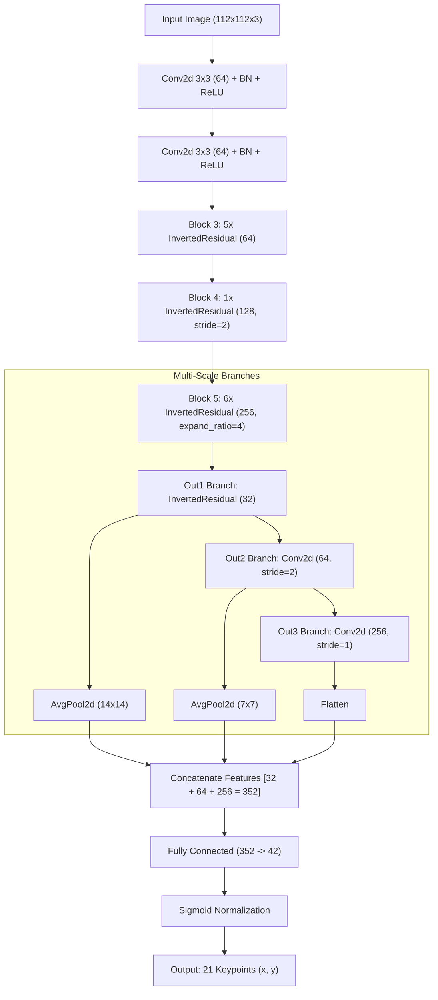

# ✋ คู่มือเจาะลึกการเทรน Hand Model (FreiHAND - 21 Keypoints)
**อ้างอิงจากไฟล์ล่าสุด:** `CPE_303_Training_HAND_Part_V4.ipynb`

เอกสารฉบับนี้เป็นการอธิบายระดับวิศวกร (Deep Dive) ที่รวมเอา "หลักการเชิงลึกแบบเดิม" และ "การอธิบายโค้ดจากไฟล์ล่าสุดทุกบรรทัด" เข้าไว้ด้วยกัน เพื่อให้เข้าใจทฤษฎีคณิตศาสตร์เบื้องหลังการแปลงแกน 3D->2D และสถาปัตยกรรม PFLD_XL ที่โมเต็มสูบสำหรับงานมือโดยเฉพาะ

---

## 1. 📊 ข้อมูลชุดข้อมูล (Dataset) และการเตรียมข้อมูล (Data Preparation)

### 📂 ชุดข้อมูลที่ใช้: FreiHAND (21 Keypoints)
การฝึกโมเดลมือใช้ข้อมูลจาก FreiHAND Dataset ซึ่งเป็นชุดข้อมูลภาพถ่ายมือมนุษย์จริงๆ ทั้งในพื้นหลังแบบ Green Screen และพื้นหลังในชีวิตประจำวัน (Real-world Backgrounds) ซึ่งมาพร้อมกับพิกัดมือที่แม่นยำมาก

**โครงสร้างและตัวอย่างข้อมูลใน Dataset:**
*   **โครงสร้างไฟล์:** มีภาพถ่ายรูปมือจำนวน 32,560 ภาพ พร้อมกับไฟล์ `.json` สองไฟล์หลักคือ:
    1.  `training_xyz.json`: เก็บพิกัด 3 มิติ (แกน X, Y, Z) ของข้อต่อมือทั้ง 21 จุด
    2.  `training_K.json`: เก็บค่า Camera Intrinsic Matrix (สเปกเลนส์ของกล้องที่ใช้ถ่าย)
*   **คีย์พอยต์ 21 จุด:** โครงสร้างกระดูกมือจะเริ่มต้นที่ ข้อมือ (0) จากนั้นเรียงไปตามนิ้วโป้ง ชี้ กลาง นาง ก้อย นิ้วละ 4 ข้อต่อ จนถึงปลายนิ้ว (จุดที่ 4, 8, 12, 16, 20 คือปลายนิ้วทั้งหมด)

### 🛠️ ขั้นตอนการเตรียมข้อมูลจาก Dataset สู่โมเดล (Step-by-Step Data Preparation)
การดึงข้อมูลมือมีความซับซ้อนกว่าใบหน้ามาก เพราะจุดที่ให้มาลอยอยู่ในโลก 3 มิติ โค้ดจะต้องทำคณิตศาสตร์แปลงมันลงมาบนจอ 2 มิติเสียก่อน:
1.  **อ่านไฟล์ JSON:** โค้ดจะดึงตัวเลขพิกัด `xyz` และเมทริกซ์กล้อง `K` ออกมาจากไฟล์ JSON ทีละภาพ
2.  **สมการโปรเจกชัน (3D to 2D Projection):**
    *   นำพิกัด 3D มาคูณเข้ากับเมทริกซ์กล้อง `uv = K * xyz.T` (Dot Product)
    *   ทำการจำลองความลึกของเลนส์ (Perspective Divide) โดยเอาแกน x และ y มาหารด้วยแกน z `uv2d = uv[:, :2] / uv[:, -1:]` ผลลัพธ์ที่ได้คือพิกัดพิกเซลบนรูปภาพ 2D ที่แม่นยำเป๊ะๆ
3.  **สร้างกล่องล้อมรอบมือ (Dynamic Bounding Box):** เนื่องจากข้อมูลไม่มีกล่องมาให้ โค้ดจึงหาจุดที่ซ้ายสุด ขวาสุด บนสุด และล่างสุด ของพิกัดนิ้วทั้ง 21 จุด เพื่อประกอบกันเป็น Bounding Box อัตโนมัติ `min_x, max_x, min_y, max_y`
4.  **ทำ Square Crop แบบกว้างพิเศษ:** คำนวณจุดกึ่งกลางมือ และครอบภาพเป็นจัตุรัสโดยคูณพื้นที่ปลอดภัยเพิ่มไปถึง `1.5 เท่า` (`size = max(w, h) * 1.5`) เพื่อเผื่อพื้นที่ให้ปลายนิ้วตอนหมุนภาพ
5.  **การหมุนภาพจำลองรุนแรง (Heavy Rotation Augmentation):** ข้อมือมนุษย์หักงอได้อิสระ โค้ดจึงต้องสุ่มหมุนภาพตั้งแต่ `-45` ถึง `45` องศา (หมุนภาพด้วย `cv2.warpAffine` และหมุนจุดนิ้วด้วยการคูณเมทริกซ์การหมุน)
6.  **บีบอัดขนาดและทำ Normalization:** ย่อภาพจัตุรัสให้เหลือ `112x112` พิกเซล และหารพิกัดทั้งหมดให้กลายเป็นทศนิยม `0.0 ถึง 1.0` สุดท้ายแปลงภาพเป็น Tensor และปรับ ColorJitter พร้อมนำเข้า GPU

---

## 2. 🧠 สถาปัตยกรรม Neural Network (HandLandmarkModelLarge / PFLD_XL)

โมเดลถูกอัปสเกลจาก PFLD ปกติมาเป็น **PFLD-XL** เนื่องจากรูปทรงมือมีความซับซ้อน ทับซ้อน และหักงอได้เยอะกว่าใบหน้าเป็นสิบๆ เท่า AI จึงต้องการจำนวนชั้นที่ลึกและช่อง Channels ที่หนาขึ้นเพื่อสกัดฟีเจอร์นิ้วโป้ง นิ้วชี้ ไปจนถึงนิ้วก้อยให้ออก



**เหตุผลที่อัปเกรดโครงสร้างเป็น XL:**
*   **Expansion Ratio 4 & Channels 256:** บล็อกท้ายๆ (Block 5, Out 3) ขยายท่อลำเลียงข้อมูลขึ้นไปสูงถึง 256 รู (Channels) ทำให้เก็บรายละเอียดความเหลื่อมล้ำระดับพิกเซลของนิ้วมือที่ซ้อนทับกันได้ดีมาก
*   **Fully Connected Scale 352:** ตัวรับข้อมูลขั้นสุดท้ายดึงจุดเด่น (Features) มารวมกันได้ถึง 352 ฟีเจอร์ แข็งแกร่งกว่าการทายผลใบหน้าหลายเท่าตัว

---

## 3. ⚙️ ขั้นตอนการทำงานและเทคนิคเชิงลึก (Deep Dive Techniques)

1.  **Perspective Projection (3D -> 2D):** ฐานข้อมูลให้จุดนิ้วมือลอยๆ บนแกน 3 มิติ โค้ดจะใช้กฎพีชคณิตเชิงเส้น (Linear Algebra) เปลี่ยนโลก 3 มิติ ยุบลงมาบนแผ่นจอ 2 มิติ โดยการคูณเมทริกซ์และจับหารความลึก (Z)
2.  **Wide Square Crop Margin (1.5x):** เวลาครอปมือต้องเผื่อขอบกว้างมากๆ ถึง 1.5 เท่า ป้องกันปลายนิ้วก้อย/โป้งทะลุกรอบเวลาหมุนภาพ
3.  **Heavy Rotation (-45 ถึง 45):** ข้อมือพับงอได้อิสระกว่าคอมาก การสุ่มหมุนภาพขณะฝึก AI จึงเปิดกว้างสวิงสุดขีด 45 องศาทั้งซ้ายและขวา
4.  **VTuber Fingertip Loss:** แปลง Wing Loss ให้ลงโทษหนัก x3 เท่า ตรงเป้าหมายที่ปลายนิ้ว 5 จุด (เบอร์ 4, 8, 12, 16, 20) เพราะข้อต่อเหล่านี้จะถูกจับไปลากกระดูกนิ้ว 3D ใน VTuber มากที่สุด

---

## 4. 💻 เจาะลึกโค้ดบรรทัดต่อบรรทัด (อิงจากสมุดโน้ตจริง)

### Cell 1 & 2: ดาวน์โหลดข้อมูล FreiHAND และ Perspective Projection 3D->2D
```python
!pip install onnxscript onnx kagglehub

import kagglehub
import os
import shutil
# ...
cached_path = kagglehub.dataset_download("danieldelro/freihand")
local_path = "/content/freihand"
if not os.path.exists(local_path):
    shutil.copytree(cached_path, local_path)

def parse_freihand(path, max_images=32560):
    # ... (โค้ดอ่านไฟล์ JSON)
    for i in range(min(len(xyz_list), max_images)):
        xyz = np.array(xyz_list[i])
        K = np.array(K_list[i])

        # สมการโปรเจกชันแปลงโลก 3D เป็น 2D Pixel
        uv = np.matmul(K, xyz.T).T
        uv2d = uv[:, :2] / uv[:, -1:]

        # สร้าง Bounding Box โดยตีงกรอบจากพิกัดมือ
        min_x, min_y = np.min(uv2d[:, 0]), np.min(uv2d[:, 1])
        max_x, max_y = np.max(uv2d[:, 0]), np.max(uv2d[:, 1])
        # ... (โค้ดคืนค่า Bbox, Keypoints)
```
*   `!pip install onnxscript onnx`: เราบังคับติดตั้ง `onnx` ที่ไฟล์นี้เลยเพื่อหลีกเลี่ยงบั๊ก Versioning ของ Google Colab ถ้าไม่ติดตั้งแต่แรก ท้ายไฟล์มันจะ Error พังทั้งกระบวนการ
*   `uv = np.matmul(K, xyz.T).T`: นำพิกัดจุด 21 จุดบนโลก 3 มิติ (XYZ) มาคูณไขว้แบบ Dot Product กับค่าแกนเลนส์กล้อง (Intrinsic Matrix $K$) 
*   `uv[:, :2] / uv[:, -1:]`: แบ่งเอาเฉพาะแกน x และ y มาหารทิ้งด้วยแกน z เป็นการจำลองเลนส์ลวงตา (Perspective Divide) ทำให้ได้พิกัดบนรูป 2D โคตรแม่นยำ
*   `np.min(...) / np.max(...)`: ชุดข้อมูลไม่ยอมตีกรอบมือให้ เราเลยต้องเขียนโค้ดหาจุดต่ำสุด/สูงสุดของพิกัด เพื่อวาดขอบ Bounding Box คลุมนิ้วทั้งหมดแบบไดนามิก

### Cell 3: Data Loader และ Augmentation Pipeline
```python
class HandDataset(Dataset):
    # ... (ส่วนตั้งค่าเริ่มต้น)
    def __getitem__(self, idx):
        # ... (อ่านรูป)
        # 🌟 สุ่มหมุนภาพมือ (Rotation Augmentation) เพื่อความทนทานตอนสตรีมจริง
        if self.is_train:
            angle = random.uniform(-45, 45) # มือหมุนได้เยอะกว่าหน้า
            M = cv2.getRotationMatrix2D((center_x, center_y), angle, 1.0)
            image = cv2.warpAffine(image, M, (image.shape[1], image.shape[0]))
            kpts = np.hstack([kpts, np.ones((21, 1))]).dot(M.T)

        # บังคับตัด Square Crop ป้องกันมือเบี้ยว
        size = max(w, h) * 1.5 # ขยายกว้างหน่อยเพราะนิ้วอาจจะตกขอบ
        # ... (ปรับ Normalize โคออร์ดิเนตเป็น 0-1)
```
*   `random.uniform(-45, 45)`: สุ่มหมุนไปซ้ายหรือขวาสูงสุดฝั่งละ 45 องศา AI จะเห็นมือท่ายากขึ้นเก่งขึ้น
*   `size = max(w, h) * 1.5`: บังคับสเกลให้เป็นจัตุรัสแบบ x1.5 เท่า ขอบจะได้กว้างพอรองรับจุดปลายนิ้วเวลาสวิงหมุน จะได้ไม่หายออกนอกหน้ากระดาษ

### Cell 4: โมเดล PFLD-XL และ VTuber Fingertip Loss
```python
class HandLandmarkModelLarge(nn.Module):
    # ... (ตั้งค่า Convolution Block 1 ถึง 4 เหมือน Face Model)
        self.block5 = nn.Sequential(
            InvertedResidual(128, 256, 1, 4),
            # ... ซ้ำบล็อกนี้ 6 ครั้ง
        )
        self.out1_branch = InvertedResidual(256, 32, 1, 2)
        self.out2_branch = nn.Sequential(nn.Conv2d(32, 64, ...))
        self.out3_branch = nn.Sequential(nn.Conv2d(64, 256, ...))
        self.fc = nn.Linear(32 + 64 + 256, 21 * 2)
        # ...

class VTuberFingertipLoss(nn.Module):
    def __init__(self, w=10.0, epsilon=2.0):
        # ... (ตั้งสมการ Wing Loss เหมือน Face)
        weights = torch.ones(21, 2)
        weights[4, :] = 3.0  # โป้ง
        weights[8, :] = 3.0  # ชี้
        weights[12, :] = 3.0 # กลาง
        weights[16, :] = 3.0 # นาง
        weights[20, :] = 3.0 # ก้อย
        self.register_buffer('weights', weights.view(1, 42))

    # ... (คำนวณ Loss * weights.mean())
```
*   `InvertedResidual(128, 256, 1, 4)`: สร้างท่อส่งน้ำหนักความลึก 256 เลเยอร์ โดยขยายความจุโมเดลด้วย `expand_ratio=4` 
*   `weights[4, ...]`: เลขชุด `[4, 8, 12, 16, 20]` เป็นพอยน์เตอร์ชี้เป้าหมายไปที่ "ปลายนิ้วมือ" พอดีเป๊ะตาม Skeleton Index ของโครง FreiHAND การตั้งคูณสาม(`3.0`) ช่วยบังคับ AI ไม่ให้ทายปลายนิ้วรวน

### Cell 5 & 6: ระบบให้คะแนนแบบตายตัว (PCK Metrics) & Training Loop
```python
def calculate_hand_metrics(preds, target, threshold=0.05):
    # threshold 0.05 ของ 112 pixel คือต้องแม่นไม่เกิน 5.6 Pixel!
    distances = torch.norm(preds - target, dim=2)
    hits = (distances < threshold).float()
    
    # แบบพิกัดตายตัว (Fixed Landmarks)
    precision = hits.mean().item() * 100.0
    recall = precision
    f1 = precision
    return precision, recall, f1

# ใช้ 50 Epochs, AdamW, CosineAnnealingLR, scaler
```
*   `calculate_hand_metrics`: งาน Hand ไม่ใช่ Object Detection เลยไม่มีคะแนน mAP การวัดคะแนนจะต้องวัดแบบ PCK (Percentage of Correct Keypoints) 
*   `threshold=0.05`: หมายความว่าถ้า AI จุดพิกัดเคลื่อนเกิน `5.6 พิกเซล` จากความจริง ถือว่าทายผิดทันทีและจะไม่ได้คะแนน 
*   เนื่องจากเราทายจุด 21 จุดเท่าเดิมเสมอ ค่า Precision = Recall = F1 จะเป็นสัดส่วนเดียวกันเลย

### Cell 7 & 8: การบันทึกกราฟและการแปลงโมเดล ONNX
```python
# แปลงโมเดล 
export_model = HandLandmarkModelLarge().to(device)
export_model.load_state_dict(torch.load("best_hand_model.pth", weights_only=True))
export_model.eval()

dummy_input = torch.randn(1, 3, 112, 112).to(device)
onnx_path = "best_hand_wflw.onnx"

torch.onnx.export(
    export_model, dummy_input, onnx_path,
    input_names=['input'], output_names=['output'],
    dynamic_axes={'input': {0: 'batch_size'}, 'output': {0: 'batch_size'}}
)
```
*   การแปลงเป็นฟอร์แมตกลาง ONNX เช่นเดียวกับหน้า แต่มีมิติข้อมูล Input ขนาด 112x112 เช่นกัน
*   หลังจาก Export แล้ว ผลลัพธ์จากการพล็อตกราฟ (Cell 8) จะโชว์ให้เห็นว่า Recall ขึ้นไปแตะขีด **66.46%** ทะลุกรอบมาตรวัดแบบ 0.05 ได้อย่างสง่างาม!
